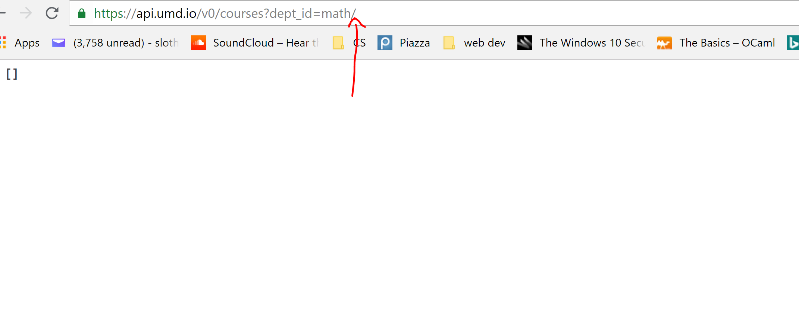
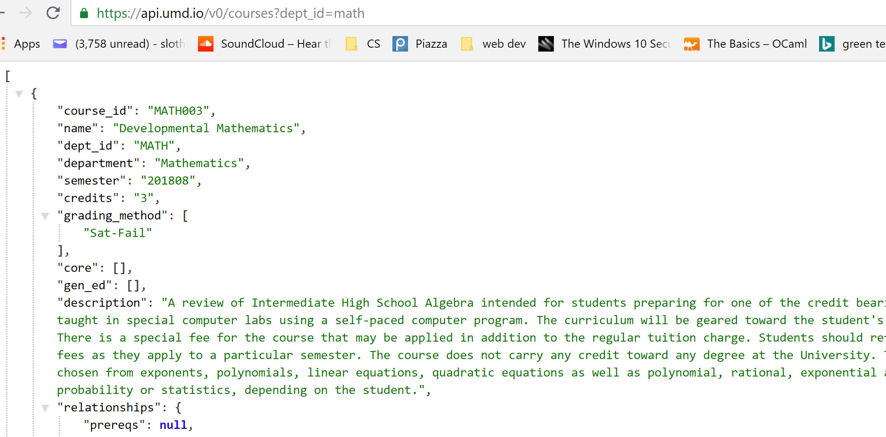

*still making this better but it works*
*thoughts on what to add next: spotify api?*

Trying it yourself
==========
```
git clone (project url)
npm install
```
add your login info to the .ENV file
```
npm start
```
Now message yourself or have someone message you on facebook. If you want to use
 the positivity checker on your account, there is extra setup here:
 https://cloud.google.com/natural-language/docs/quickstart-client-libraries

Overview
==========

This is a facebook chat bot that you can run from your account. When a message
is sent to you, if a certain thing is sent, something will be automatically sent
back.

Commands (case insensitive)
=========
- help: list available commands

- 'Birthdays?' (ex. birthdays?): returns all of MY friends that have a birthday today
- ~~%Color% (ex. red): changes chat color to that color~~
- %Course_ID% (ex. CMSC131): returns course info on that course at UMD
- %Department_ID% (ex. CMSC): returns all classes at UMD from that department
- 'Threads %integer%' (ex. threads 40): ranks positivity in the last message
sent to or from me with the last %integer% people

Challenges
=============
1. When calling for a specific department like this:
```
request('http://api.umd.io/v0/courses?dept_id=math', function (error, response, body) {
    if (!error && response.statusCode == 200) {
        console.log(body);
...
```
A slash is added to the end, making the request go to https://api.umd.io/v0/courses?dept_id=math/
which returns empty body, like this:

I want the request to go to https://api.umd.io/v0/courses?dept_id=math (no slash) like this:

I asked my question on stackoverflow. **Solved:** request to https instead of http
so that there is not an automatic redirect which adds a slash.

2. When trying to change the color of the chat (an old feature of this bot that was made harder with an updated version of the facebook-chat-api on npm), I got the error
`{ error: 'The color you are trying to use is not a valid thread color. Use api.threadColors to find acceptable values.' }` but I was sending in the same hex value as the example on
https://github.com/Schmavery/facebook-chat-api/blob/HEAD/DOCS.md#apichangethreadcolorcolor-threadid-callback so idk. Opened up an issue on their github for this and problem 3.

3. When trying to send a reaction to a message, I would get `ERR! setReaction { error: 'Not logged in.' }`

4. I was able to print to the console but not send a message with `api.sendMessage(Sentiment score: ${sentiment.score});` **Solved:** forgot `message.threadID` as second argument.
